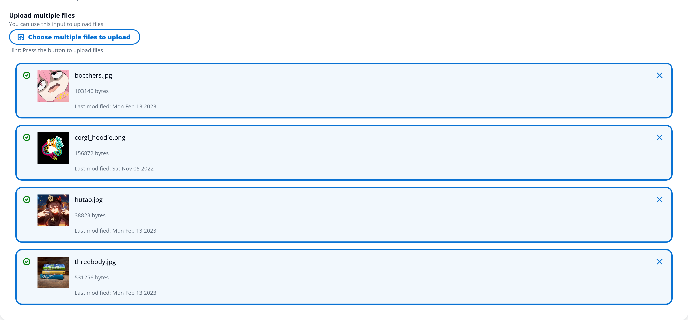

# Cloudscape File Uploader

[](https://github.com/jasmaa/cloudscape-file-uploader/actions/workflows/build.yml)
[](https://app.codecov.io/gh/jasmaa/cloudscape-file-uploader)

A file uploader for Cloudscape following: https://cloudscape.design/components/fileupload/



## Usage

Install the package:

```
# TODO
```

See more [examples](./examples/cloudscape-file-uploader-example).

## Development

Install packages and build dist:

```
yarn install
yarn build
```

## Testing

Test with:

```
yarn test
```

Fix prettier with:

```
npx prettier --write .
```

Fix eslint with:

```
npx eslint --fix .
```
